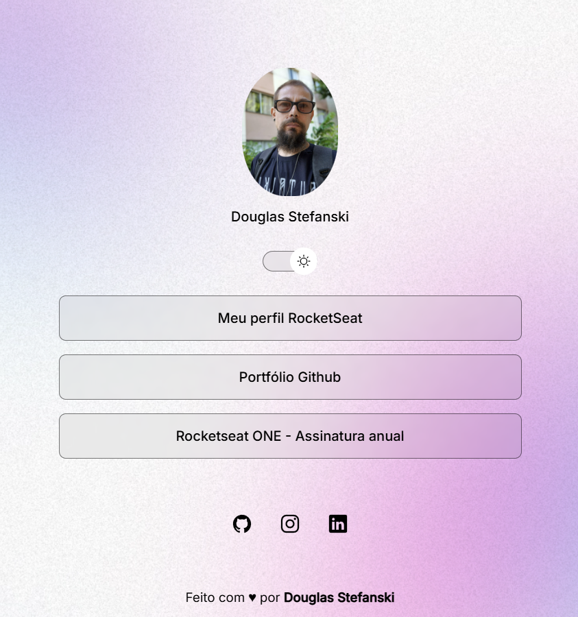
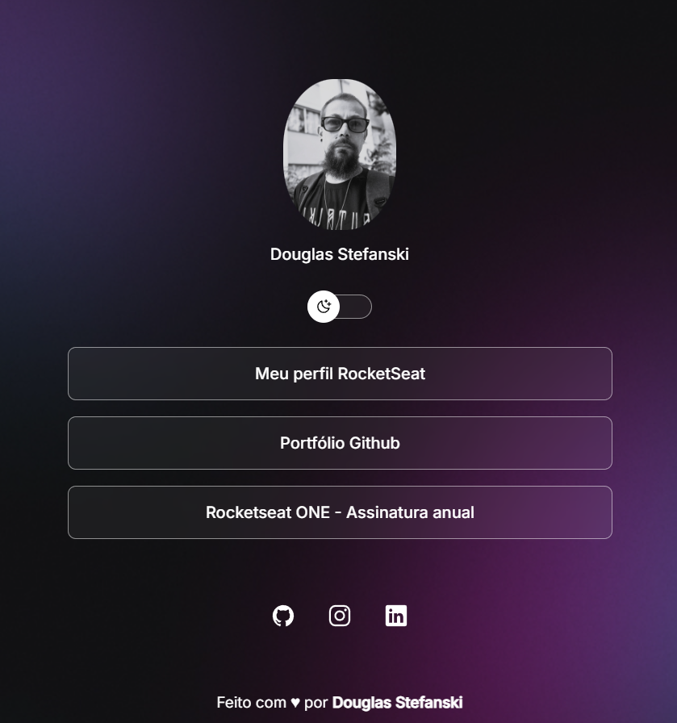

<h1 align="center"> DevLinks </h1>

O DevLinks é um agregador de links para usar como cartão de visitas online.

 

# 💻 Projeto

Projeto desemvolvido no corso Discovery da Rocketseat.

 

  
  

 

# 🚀 Tecnologias

Esse projeto foi desenvolvido com as seguintes tecnologias:

- HTML e CSS
- JavaScript
- Git e Github
- Figma

 

# 🔖 Layout

Você pode visualizar o layout do projeto através [DESSE LINK](https://www.figma.com/community/file/1187422022288947321). É necessário ter conta no [Figma](https://figma.com) para acessá-lo.
